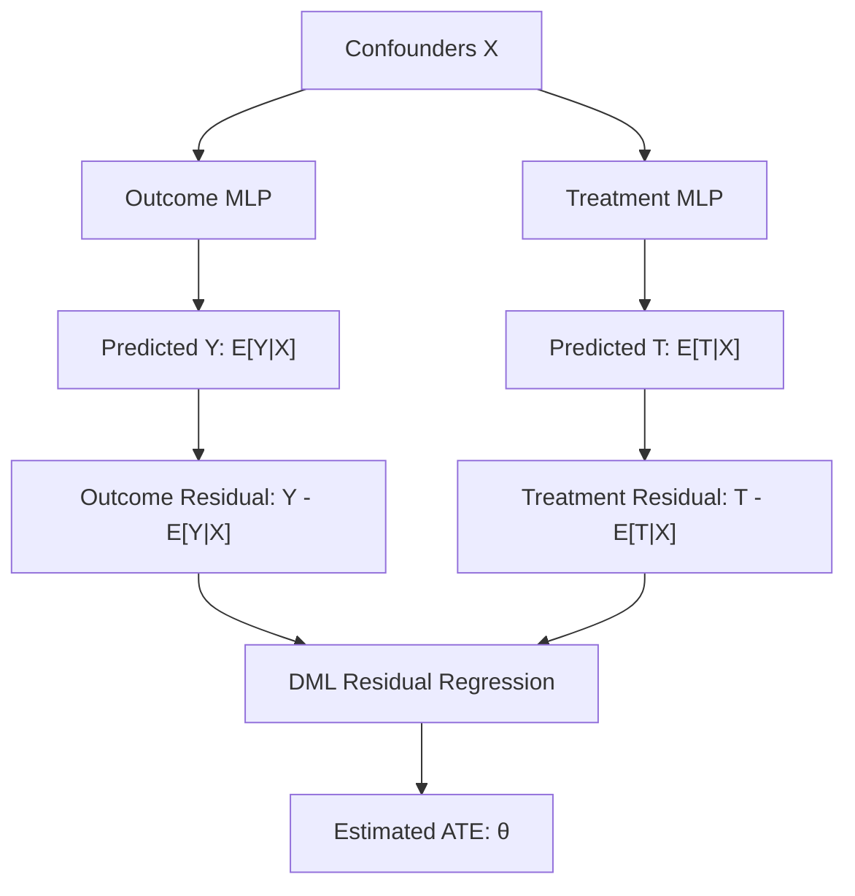

# Deep-DML

A lightweight neural Double Machine Learning toolkit for causal treatment-effect estimation.

[](https://www.python.org/)
[](LICENSE)
[](https://github.com/<username>/deep-dml/actions)

---

## Overview

**Deep-DML** is an open-source Python toolkit for neural Double Machine Learning (DML) and causal treatment-effect estimation from observational data. It implements Chernozhukov et al.'s Double/Debiased Machine Learning framework for partially linear models, using PyTorch multi-layer perceptrons as flexible non-parametric nuisance estimators coupled with K-fold cross-fitting and Neyman-orthogonal score residualization.

In observational studies, naive regression estimates of treatment effects often suffer from severe confounding bias, while standard machine learning models applied directly to outcome prediction can introduce regularization bias. Double Machine Learning resolves both challenges: non-parametric models isolate the confounding relationships, and orthogonalized residual regression extracts root-N consistent, asymptotically unbiased estimates of the Average Treatment Effect (ATE).

Deep-DML is designed to provide a clean, accessible, and self-contained implementation suitable for researchers, developers, students, and practitioners exploring the intersection of deep learning and causal inference.

---

## Why Deep-DML?

Modern causal inference libraries often feature large, multi-layered abstractions that can be challenging to audit, extend, or adapt for specialized research questions. While mature production frameworks exist in the open-source ecosystem (such as EconML, DoWhy, CausalML, and DoubleML), there is a distinct need for a compact, readable codebase focused on foundational neural DML mechanics.

Deep-DML does not aim to replace established causal ecosystems. Instead, it provides:
- **Radical clarity**: A streamlined codebase where mathematical operations map directly to clean Python functions.
- **Neural flexibility**: Native PyTorch nuisance models that serve as a transparent starting point for deep causal architectures.
- **Leakage-free cross-fitting**: Rigorous out-of-fold sample splitting where all preprocessing and training remain isolated to training folds.
- **Zero bloat**: A lightweight package with minimal dependencies that installs and runs tests in seconds on standard CPU hardware.

---

## Key Features

- **Neural Nuisance Estimation**: Lightweight PyTorch Multi-Layer Perceptrons for modeling conditional outcome expectations $\mathbb{E}[Y|X]$ and conditional treatment expectations $\mathbb{E}[T|X]$.
- **K-Fold Cross-Fitting**: Out-of-fold nuisance evaluation preventing data reuse and mitigating overfitting bias.
- **DML Residualization**: Neyman-orthogonal score equations that insulate treatment-effect estimation from first-order nuisance estimation errors.
- **Average Treatment Effect (ATE)**: Direct computation of the constant treatment effect parameter $\theta$ via residual regression.
- **Synthetic Causal Data Generator**: Built-in `make_synthetic_causal_data` generator with configurable confounding, non-linearities, and treatment effect ground truth.
- **Residual Diagnostics**: Practical post-estimation metrics via `residual_summary` to inspect treatment and outcome residual balance.
- **NumPy & pandas Support**: Seamless ingestion of standard NumPy arrays, pandas DataFrames, and pandas Series.
- **Reproducible Examples**: Self-contained scripts demonstrating synthetic benchmark evaluations and custom array ingestion.
- **Automated Testing**: Comprehensive unit tests covering estimator consistency, edge cases, numerical boundaries, and reproducibility.
- **Lightweight Dependencies**: Built strictly on standard scientific Python libraries (`numpy`, `pandas`, `scikit-learn`, `torch`).

---

## Architecture



---

## Installation

You can clone and install the package locally in editable development mode:

```bash
# Clone the repository (replace <username> with your GitHub handle)
git clone https://github.com/<username>/deep-dml.git
cd deep-dml

# Install dependencies and package in editable mode
pip install -e .
```

To include test and development dependencies:

```bash
pip install -e ".[dev]"
```

---

## Quick Start

```python
from deepdml import DeepDML, make_synthetic_causal_data

# 1. Generate synthetic observational data with known ATE = 2.0
X, treatment, outcome, true_effect = make_synthetic_causal_data(
    n_samples=1000,
    n_features=8,
    treatment_effect=2.0,
    random_state=42,
)

# 2. Instantiate the neural Double Machine Learning estimator
model = DeepDML(
    hidden_dim=32,
    epochs=50,
    learning_rate=0.01,
    n_splits=3,
    random_state=42,
)

# 3. Fit on observational data using K-fold cross-fitting
model.fit(X, treatment, outcome)

# 4. Inspect estimated Average Treatment Effect
print(f"True Treatment Effect: {true_effect:.3f}")
print(f"Estimated ATE:         {model.ate_:.3f}")

# 5. Display estimation summary
model.summary()
```

Output:
```text
True Treatment Effect: 2.000
Estimated ATE:         1.489

Deep-DML Estimation Summary
----------------------------------------
Samples:                1000
Features:               8
Cross-fitting folds:    3
Estimated ATE:          1.4889
Treatment residual std: 0.6169
Outcome residual std:   1.3437
----------------------------------------
```

---

## How It Works

Deep-DML models the partially linear structural equation system:

$$\begin{aligned}
Y &= \theta T + g(X) + \varepsilon, \quad &\mathbb{E}[\varepsilon \mid X, T] = 0 \\
T &= m(X) + \nu, \quad &\mathbb{E}[\nu \mid X] = 0
\end{aligned}$$

where $X$ represents observed confounders, $T$ is the treatment (continuous or binary), $Y$ is the observed outcome, and $\theta$ is the causal parameter of interest (ATE).

The estimation proceeds in four main stages:

1. **Nuisance Function Estimation**:
   The conditional expectations $g(X) = \mathbb{E}[Y|X]$ and $m(X) = \mathbb{E}[T|X]$ are approximated non-parametrically using multi-layer perceptrons.
2. **K-Fold Cross-Fitting**:
   To prevent overfitting and eliminate sample-reuse bias, the dataset is partitioned into $K$ folds. For each fold $k$, nuisance models are trained exclusively on the remaining $K - 1$ folds and used to generate predictions strictly for the held-out fold $k$. Any feature standardization is fitted strictly on the training fold to avoid data leakage.
3. **Neyman-Orthogonal Residualization**:
   Out-of-fold residuals are constructed:
   $$\tilde{Y} = Y - \hat{g}(X), \qquad \tilde{T} = T - \hat{m}(X)$$
   Orthogonal score residualization ensures that the first-order estimation errors of $\hat{g}$ and $\hat{m}$ do not bias the estimation of $\theta$.
4. **Treatment-Effect Estimation**:
   The Average Treatment Effect is solved using the closed-form orthogonal regression:
   $$\hat{\theta} = \frac{\sum_{i=1}^N \tilde{T}_i \tilde{Y}_i}{\sum_{i=1}^N \tilde{T}_i^2}$$
   Deep-DML incorporates safeguards ensuring the denominator $\sum \tilde{T}_i^2$ does not trigger division by zero or numerical instability.

---

## Current Scope

Version `1.0.0` focuses intentionally on a compact, highly reliable partially linear Double Machine Learning estimator for the constant Average Treatment Effect (ATE). It handles both continuous treatments and binary treatments (coded as 0 and 1) via regression-based nuisance models.

---

## Limitations

- **Constant Treatment Effect**: Version 1.0.0 estimates a single scalar ATE ($\theta$) and does not estimate heterogeneous effects (CATE).
- **Confidence Intervals**: Analytic standard errors and bootstrap-based confidence intervals are not yet implemented in Version 1.0.0.
- **Overlap Diagnostics**: Advanced propensity overlap checking (such as trimming rules or propensity histograms) is not automated.
- **Nuisance Architectures**: PyTorch nuisance networks use standard feedforward MLP architectures.
- **Target Audience & Usage**: Deep-DML is intended for research, education, experimentation, and methodological prototyping. For high-stakes, safety-critical industrial decisions, users are encouraged to consult mature, validated production ecosystems such as EconML or DoubleML.

---

## Roadmap

Future minor and major releases will explore:
- **CATE Estimation**: Conditional Average Treatment Effects via R-Learner or doubly robust neural architectures.
- **Confidence Intervals & Hypothesis Testing**: Asymptotic standard errors, multiplier bootstrap, and confidence intervals for $\hat{\theta}$.
- **Alternative Nuisance Learners**: Plug-and-play interfaces for tree-based learners (LightGBM, XGBoost) and arbitrary custom PyTorch modules.
- **Configurable Architectures**: Custom layer definitions, dropout, batch normalization, and weight decay configurations.
- **Overlap & Positivity Diagnostics**: Automated checks and visual warnings for propensity violations and covariate imbalance.
- **Benchmark Datasets**: Examples using classic empirical causal datasets such as IHDP, ACIC, and Twins.
- **Ecosystem Benchmarking**: Systematic comparisons against established causal inference toolkits.
- **GPU Acceleration**: Automated CUDA execution for high-dimensional or massive sample settings.
- **Expanded Documentation & Tutorials**: Comprehensive guides detailing causal identification assumptions and sensitivity analysis.

---

## Contributing

We warmly welcome contributions! Please refer to [CONTRIBUTING.md](CONTRIBUTING.md) for instructions on setting up your environment, running tests, and submitting pull requests.

Areas where contributions are especially appreciated:
- Bug reports and reproduction cases
- Feature suggestions and API design discussions
- Documentation improvements and tutorials
- Additional test cases and benchmark evaluations

Please review our [Code of Conduct](CODE_OF_CONDUCT.md) before participating.

---

## License

This project is licensed under the terms of the [MIT License](LICENSE).

Copyright (c) 2026 Tarun Gudipalli.
